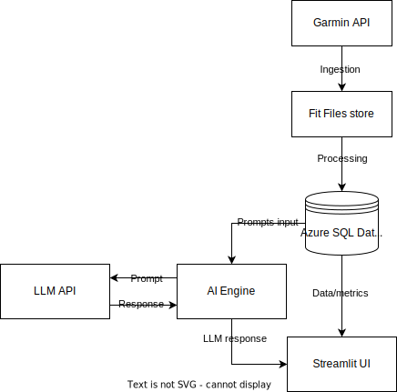

# Garmin-Buddy 🏃‍♂️📊🤖

Garmin-Buddy is a Python-based **data + AI application** that ingests my Garmin activity data, stores and models it in a relational database, computes training metrics, and uses **LLMs** to generate **training insights**. It also includes a simple **data app UI** for reviewing recent activities, trends, and AI-generated summaries.

---

## What problem it solves

Garmin gives you lots of data, but turning it into **decisions** is harder:
- What should I change next week given my history?
- Is the training load distributed well over time?
- Is the training execution aligned with intended stimuli?


Garmin-Buddy turns raw activity logs into:
- structured metrics and trends, and
- **context-aware AI commentary** based on my training history (not generic advice).

---

## High-level architecture

**Flow**
1. Ingest activities from Garmin API
2. Store processed data in a relational DB (Azure SQL)
3. Compute training metrics (weekly load, intensity distribution, trends)
4. Use AI layer (LLM + retrieval) to generate insights and planning suggestions
5. Present results in a simple UI (Streamlit)

**Components**
- **Ingestion**: Garmin API / FIT parsing
- **Processing**: metrics, transformations, aggregation
- **Database**: SQLAlchemy models + migrations
- **AI Engine**: prompts + structured output + RAG over training history
- **UI**: Streamlit dashboard




---

## What this project incorporates 

- **Data ingestion & ETL** (external data → normalized storage → analytics-ready tables)
- **Relational modeling** (SQL schema design, migrations, consistency)
- **Analytical feature engineering** (training metrics that support decisions)
- **LLM integration** (structured outputs, prompt design)
- **RAG** (injecting relevant historical context into AI reasoning)
- **Data app UI** (decision-support dashboard)
- **Cloud deployment** (Azure-friendly setup)
- **Production mindset** (config management, logging, error handling, CI-ready structure)

---

## Key Features

### Current 
- Garmin activity ingestion (API / FIT files)
- Storage in SQL database (Azure SQL)
- Basic computed metrics (distance, time, pace, trends)
- Initial UI (Streamlit): recent activities table + top activities views

### Planned / In progress
- Training load tracking (weekly summaries, intensity distribution)
- Fatigue / readiness indicators based on data proxies (non-medical)
- AI-generated weekly summary and training recommendations
- RAG over training history for contextual answers (“why is this week harder?”)
- Deployment + CI/CD (Docker + GitHub Actions + Azure)

---

## Project structure

```text
garmin-buddy/
├── app/
│   ├── services/       # Garmin API, FIT loading/parsing, transformations
│   ├── ai/              # prompts, LLM clients, RAG, evaluations
│   ├── database/              # SQLAlchemy models, session, migrations
├── ui/                  # Streamlit app
├── docs/                # architecture, roadmap, internal notes
├── notebooks/           # experiments only (no core logic)
├── tests/
├── .env.example
├── README.md
└── pyproject.toml
```

## Tech stack

- **Language:** Python
- **Data processing:** pandas
- **Database / ORM:** Azure SQL + SQLAlchemy
- **Ingestion:** Garmin Connect API client, FIT file parsing (e.g., `fitparse`)
- **UI:** Streamlit
- **LLM providers:** OpenAI and/or Google (configurable)
- **Embeddings / RAG:** FAISS or Chroma
- **Packaging / runtime:** Docker
- **CI/CD:** GitHub Actions (planned)

## Setup

### Prerequisites
- Python 3.11+ recommended
- Access to a Garmin account (for API ingestion)
- A SQL database (local or Azure SQL)
- LLM API key (OpenAI and/or Google) for AI features

### Environment variables
Copy `.env.example` → `.env` and fill in:

```bash
GARMIN_EMAIL=
GARMIN_PASSWORD=
DB_CONNECTION_STRING=
OPENAI_API_KEY=
GOOGLE_API_KEY=
FIT_DIR_PATH=
```

> The app fails fast if required variables are missing.

## Run locally

### 1) Install dependencies
```bash
pip install -r requirements.txt
```

### 2) Run the Streamlit UI
```bash
streamlit run app/ui/app.py
```

### 3) Sync activities 
```bash
python -m app.services.sync_service
```


## AI usage notes

Garmin-Buddy provides **training insights**, not medical advice. AI outputs are:

- derived from my activity history and computed metrics,
- constrained using structured output formats where possible,
- treated as decision support, not truth.

If you implement RAG:

- the AI assistant answers using retrieved historical sessions and summaries,
- reducing hallucination risk and increasing relevance.

## Roadmap

Sprint-based plan lives in `docs/roadmap.md`.

Short version:

- **MVP:** ingestion → DB → metrics → UI → AI weekly summary
- **v0.2:** RAG + structured LLM pipelines + evaluation notebook
- **v0.3:** deployment + CI/CD + polished demo

## Screenshots / Demo

- Screenshots: add to `/docs/images/` and link here
- Demo video: add link once recorded

## License
```text
TBD (MIT recommended for portfolio projects unless you have reasons to restrict usage).
```